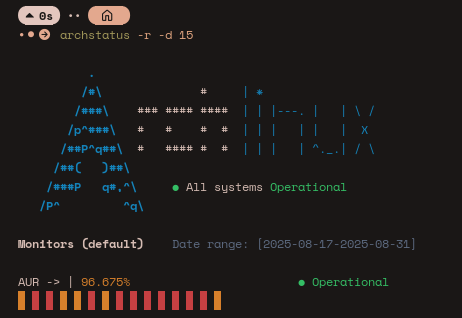

# archstatus

`archstatus` is a command-line tool written in C which displays the current status of the services provided by the Arch Linux team.

The purpose of this tool is to be used whenever the user suspects something's off with Arch Linux's services like AUR being partially down.

## How it works

`archstatus` attempts to fetch status info using the available endpoints at [status.archlinux.org](https://status.archlinux.org)

The JSON data replied by the status API is deserialized and used to format messages and pretty stuff to show in your terminal.

## Dependencies

*   [cJSON](https://github.com/DaveGamble/cJSON)
*   [libcurl](https://github.com/curl/curl)

## Build using meson

1.  **Clone the repository:**
    ```bash
    git clone https://github.com/pvtoari/archstatus
    cd archstatus
    ```

2.  **Setup project with meson**
    ```bash
    meson setup build
    ```

3.  **Compile and install**
    ```bash
    meson compile -C build
    sudo meson install -C build
    ```

## Usage

|Option     |Long option            |Required   |Description                                    |
|-          |-                      |-          |-                                              |
| `e`       | `events`              | No        | Show latest status events                     |
| `f`       | `forum`               | No        | Show forum status                             |
| `s`       | `site`                | No        | Show website status                           |
| `r`       | `aur`                 | No        | Show AUR status                               |
| `w`       | `wiki`                | No        | Show wiki status                              |
| `d <amt>` | `ratio-amount <amt>`  | No        | Amount of daily ratios to show (default: 30)  |
| `h`       | `help`                | No        | Shows the help message                        |

For example:
```bash
archstatus -r -d 15
```

This will show AUR's current status and the latest 15 days' daily ratios.



## License

This project is licensed under the MIT license. See the `LICENSE` file for details.
